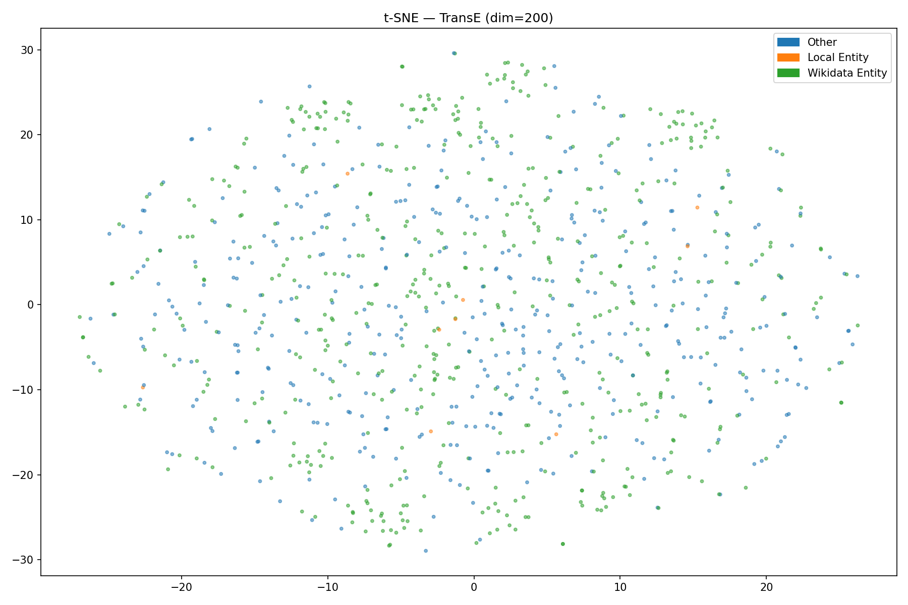

# Olympic Knowledge Graph — Web Data Mining Project

> **Domain:** Olympic Games & Sports  
> **Pipeline:** Web Crawling → NER → RDF Knowledge Graph → Wikidata Alignment → KG Expansion → KGE → SWRL Reasoning → RAG Chatbot

---

## Table of Contents

1. [Project Overview](#1-project-overview)
2. [Hardware Requirements](#2-hardware-requirements)
3. [Installation](#3-installation)
4. [Project Structure](#4-project-structure)
5. [How to Run Each Module](#5-how-to-run-each-module)
6. [How to Run the RAG Demo](#6-how-to-run-the-rag-demo)
7. [Ollama Setup](#7-ollama-setup)
8. [Data & Large Files](#8-data--large-files)
9. [Screenshots](#9-screenshots)
10. [Environment / Reproducibility](#10-environment--reproducibility)

---

## 1. Project Overview

This project builds a full Knowledge Graph (KG) pipeline over the Olympic Games domain, covering:

| Step | Module | Output |
|------|--------|--------|
| Web Crawling + NER | `src/ie/extraction.py` | `data/extracted_knowledge.csv` |
| KG Construction | `src/crawl/crawler.py` | `kg_artifacts/graph.ttl` |
| Entity Linking | `src/kg/alignment.py` | `kg_artifacts/alignment.ttl` + `mapping_table.csv` |
| Predicate Alignment | `src/kg/predicate_alignment.py` | `kg_artifacts/predicate_alignment.ttl` |
| KB Expansion via SPARQL | `src/kg/expansion.py` | `kg_artifacts/expanded.nt` |
| Ontology Generation | `src/kg/generate_ontology.py` | `kg_artifacts/ontology.owl` |
| SWRL Reasoning | `src/reason/swrl.py` | `kg_artifacts/graph_enriched.owl` |
| Knowledge Graph Embedding | `src/kge/tp5.py` | `reports/kge_report.json`, `reports/tsne_TransE.png` |
| RAG Chatbot | `src/rag/rag.py` | `reports/rag_evaluation.json` |

**Final KB stats:**
- 51,219 triples in `expanded.nt`
- 20,995 unique entities
- 1,674 distinct relations
- Train / Valid / Test split: 17,830 / 310 / 275

---

## 2. Hardware Requirements

| Component | Minimum | Recommended |
|-----------|---------|-------------|
| RAM | 8 GB | 16 GB |
| CPU | 4 cores | 8 cores |
| Storage | 2 GB | 5 GB |
| GPU | Not required | Optional (speeds up KGE) |
| OS | Windows 10 / macOS 12 / Ubuntu 20.04 | Any recent Linux |
| Python | 3.9+ | 3.11+ |
| Java | Required for Pellet reasoner (SWRL) | JDK 17+ |

> **Note:** The RAG module requires Ollama running locally. No GPU is needed — small models (1–3B parameters) run on CPU.

---

## 3. Installation

### 3.1 Clone and set up the environment

```bash
git clone <your-repo-url>
cd project-root

# Create virtual environment
python -m venv venv

# Activate (Linux/macOS)
source venv/bin/activate

# Activate (Windows)
venv\Scripts\activate

# Install all dependencies
pip install -r requirements.txt
```

### 3.2 Download spaCy model (required for NER)

```bash
python -m spacy download en_core_web_trf
```

### 3.3 Install Java (required for SWRL reasoning with Pellet)

- **Windows:** Download JDK 17+ from https://adoptium.net
- **Linux:** `sudo apt install default-jdk`
- **macOS:** `brew install openjdk`

Verify installation:
```bash
java -version
```

---

## 4. Project Structure

```
project-root/
├── data/
│   ├── crawler_output.jsonl        # Raw crawled pages (7 Wikipedia pages)
│   ├── extracted_knowledge.csv     # NER output: 1,792 entities (PERSON/ORG/GPE)
│   └── kge/
│       ├── train.txt               # 17,830 triples (80%)
│       ├── valid.txt               # 310 triples (10%)
│       └── test.txt                # 275 triples (10%)
├── kg_artifacts/
│   ├── graph.ttl                   # Initial RDF graph (Step 1)
│   ├── ontology.ttl                # Ontology definition
│   ├── ontology.owl                # OWL ontology for reasoning
│   ├── alignment.ttl               # Entity alignment with Wikidata (Step 2)
│   ├── mapping_table.csv           # Entity → Wikidata QID mapping table
│   ├── predicate_alignment.ttl     # Predicate alignment (Step 3)
│   ├── predicate_mapping.csv       # Predicate → Wikidata property mapping
│   ├── expanded.nt                 # Expanded KB (Step 4) — 51,219 triples
│   ├── expanded.ttl                # Same, Turtle format
│   └── graph_enriched.owl          # Post-reasoning enriched graph (SWRL)
├── reports/
│   ├── kge_report.json             # KGE evaluation results (MRR, Hits@K)
│   ├── rag_evaluation.json         # RAG evaluation on 5 questions
│   └── tsne_TransE.png             # t-SNE visualization of embeddings
├── src/
│   ├── crawl/
│   │   └── crawler.py              # Step 1: KG construction from CSV
│   ├── ie/
│   │   └── extraction.py           # Crawling + NER (spaCy)
│   ├── kg/
│   │   ├── alignment.py            # Step 2: Entity linking with Wikidata
│   │   ├── predicate_alignment.py  # Step 3: Predicate alignment (interactive)
│   │   ├── expansion.py            # Step 4: KB expansion via SPARQL
│   │   └── generate_ontology.py    # OWL ontology generation
│   ├── kge/
│   │   └── tp5.py                  # KGE: TransE + DistMult training & eval
│   ├── rag/
│   │   └── rag.py                  # RAG chatbot (SPARQL + Ollama)
│   └── reason/
│       └── swrl.py                 # SWRL reasoning with OWLReady2 + Pellet
├── README.md
└── requirements.txt
```

---

## 5. How to Run Each Module

> Run all commands from the `project-root/` directory.

### Module 1 — Web Crawling + NER

Crawls 7 Wikipedia pages and extracts named entities (PERSON, ORG, GPE).

```bash
python src/ie/extraction.py
```

**Output:** `data/extracted_knowledge.csv` (1,792 entities)

---

### Module 2 — KG Construction (Step 1)

Builds the initial RDF graph from the CSV. Infers relations between co-mentioned entities.

```bash
python src/crawl/crawler.py
```

**Output:** `kg_artifacts/graph.ttl`  
**Stats:** ~920 triples, 3 classes (Person, Organization, Place), 4 properties

---

### Module 3 — Entity Linking with Wikidata (Step 2)

Links local entities to Wikidata via the search API. Requires internet access.

```bash
python src/kg/alignment.py --graph kg_artifacts/graph.ttl \
                            --out kg_artifacts/alignment.ttl \
                            --csv kg_artifacts/mapping_table.csv

# To test quickly with 20 entities only:
python src/kg/alignment.py --graph kg_artifacts/graph.ttl --limit 20
```

**Output:** `kg_artifacts/alignment.ttl`, `kg_artifacts/mapping_table.csv`

---

### Module 4 — Predicate Alignment (Step 3 — Interactive)

Searches Wikidata SPARQL for equivalent predicates. You manually choose the best match.

```bash
python src/kg/predicate_alignment.py \
    --graph kg_artifacts/alignment.ttl \
    --out   kg_artifacts/predicate_alignment.ttl \
    --csv   kg_artifacts/predicate_mapping.csv
```

**Interaction example:**
```
── Aligning predicate: ont:memberOf ──
  0   P463     member of       organization the subject is a member of
  1   P1416    affiliation     organization a person is affiliated with
  
  Your choice [0-N / s to skip] > 0
  Relation type [1=equivalent / 2=subPropertyOf] > 1
   ont:memberOf  owl:equivalentProperty  wdt:P463
```

**Output:** `kg_artifacts/predicate_alignment.ttl`, `kg_artifacts/predicate_mapping.csv`

---

### Module 5 — KB Expansion via SPARQL (Step 4)

Expands the KB from 920 to 51,219 triples via Wikidata SPARQL (3 phases: 1-hop, predicate-controlled, 2-hop).

```bash
python src/kg/expansion.py \
    --graph kg_artifacts/predicate_alignment.ttl \
    --out   kg_artifacts/expanded.nt

# With custom SPARQL limit per query:
python src/kg/expansion.py --graph kg_artifacts/predicate_alignment.ttl --limit 300
```

**Output:** `kg_artifacts/expanded.nt` (51,219 triples)  
**Note:** Takes 20–60 min depending on internet speed. Requires Wikidata SPARQL access.

---

### Module 6 — Ontology Generation

Generates an OWL ontology file from the RDF graph for use with reasoners.

```bash
python src/kg/generate_ontology.py
```

**Output:** `kg_artifacts/ontology.owl`

---

### Module 7 — SWRL Reasoning

Applies SWRL rule: `Person(?p) ∧ memberOf(?p, ?o) ∧ Organization(?o) ∧ locatedIn(?o, ?l) → VIP_Entity(?p)`

```bash
python src/reason/swrl.py
```

**Prerequisites:** Java must be installed (Pellet reasoner).  
**Output:** `kg_artifacts/graph_enriched.owl`

---

### Module 8 — Knowledge Graph Embedding (KGE)

Trains TransE and DistMult, evaluates with MRR/Hits@K, generates t-SNE plot.

```bash
# Quick run (5 min)
python src/kge/tp5.py --graph kg_artifacts/expanded.nt --epochs 30 --dim 50

# Full run (as used for report)
python src/kge/tp5.py --graph kg_artifacts/expanded.nt --epochs 100 --dim 100
```

**Output:** `reports/kge_report.json`, `reports/tsne_TransE.png`, `data/kge/train.txt` / `valid.txt` / `test.txt`

**Results obtained:**

| Model | MRR | Hits@1 | Hits@3 | Hits@10 |
|-------|-----|--------|--------|---------|
| TransE | 0.1239 | 0.000 | 0.235 | 0.350 |
| DistMult | 0.0156 | 0.005 | 0.025 | 0.030 |

---

## 6. How to Run the RAG Demo

The RAG module generates SPARQL queries from natural language questions and retrieves grounded answers from the knowledge graph.

### Prerequisites

Ollama must be running with a model pulled (see [Section 7](#7-ollama-setup)).

### Run the interactive CLI

```bash
python src/rag/rag.py --graph kg_artifacts/expanded.nt

# With a different model:
python src/rag/rag.py --graph kg_artifacts/expanded.nt --model gemma:2b
```

**Example session:**

```
  Olympic KG Chatbot — RAG + Ollama
  Type your question. 'quit' to exit. 'eval' to run evaluation.

  Question > List all persons in the knowledge graph.

  ══ BASELINE (LLM alone) ══════════════════════════════
  I don't have a personal knowledge graph...

  ══ RAG (SPARQL + graph) ══════════════════════════════
  [SPARQL used]
    SELECT ?person ?label WHERE {
      ?person a <http://myolympicgraph.org/ontology/Person> .
      OPTIONAL { ?person <http://www.w3.org/2000/01/rdf-schema#label> ?label .
                 FILTER(LANG(?label) = "" || LANG(?label) = "en") }
    } LIMIT 20

  [Results — 20 row(s)]
  person | label
  ────────────────────────────────────────
  ...Irena | Irena
  ...Pierre_de_Coubertin | Pierre de Coubertin
  ...Athens | Athens
```

### Run the evaluation (5 questions)

```bash
python src/rag/rag.py --graph kg_artifacts/expanded.nt --eval
```

**Output:** `reports/rag_evaluation.json`

### Disable SPARQL self-repair

```bash
python src/rag/rag.py --graph kg_artifacts/expanded.nt --no-repair
```

---

## 7. Ollama Setup

### Step 1 — Install Ollama

- **Linux/macOS:** `curl -fsSL https://ollama.com/install.sh | sh`
- **Windows:** Download from https://ollama.com/download

### Step 2 — Start the Ollama server

```bash
# In a separate terminal (keep it running)
ollama serve
```

Verify it works by visiting http://localhost:11434 — you should see `Ollama is running`.

### Step 3 — Pull a model

```bash
# Recommended (best quality/speed balance)
ollama pull llama3.2:latest

# Lighter alternatives if RAM is limited
ollama pull gemma:2b
ollama pull deepseek-r1:1.5b
ollama pull qwen:0.5b
```

### Step 4 — Verify the model works

```bash
curl http://localhost:11434/api/generate -d '{
  "model": "llama3.2:latest",
  "prompt": "Who founded the Olympic Games?",
  "stream": false
}'
```

### Model recommendations by RAM

| Available RAM | Recommended model |
|---------------|-------------------|
| 4 GB | `qwen:0.5b` or `deepseek-r1:1.5b` |
| 8 GB | `gemma:2b` or `llama3.2:1b` |
| 16 GB+ | `llama3.2:latest` (3B) |

---

## 8. Data & Large Files

### Files included in repository

| File | Size | Description |
|------|------|-------------|
| `data/extracted_knowledge.csv` | 117 KB | 1,792 named entities extracted by NER |
| `data/crawler_output.jsonl` | 316 KB | Raw text from 7 Wikipedia pages |
| `kg_artifacts/graph.ttl` | 48 KB | Initial RDF graph |
| `kg_artifacts/alignment.ttl` | 77 KB | Entity alignment with Wikidata |
| `kg_artifacts/predicate_alignment.ttl` | 77 KB | Predicate alignment |
| `kg_artifacts/mapping_table.csv` | 31 KB | Entity → QID mapping (189 entities) |
| `kg_artifacts/predicate_mapping.csv` | 1.5 KB | 4 predicates aligned to Wikidata |
| `data/kge/train.txt` | 2.1 MB | KGE training split |
| `reports/kge_report.json` | 3.5 KB | Evaluation results |
| `reports/rag_evaluation.json` | 3.5 KB | RAG evaluation on 5 questions |
| `reports/tsne_TransE.png` | 238 KB | t-SNE embedding visualization |

### Large files (not included — regenerate or download)

| File | Size | How to obtain |
|------|------|---------------|
| `kg_artifacts/expanded.nt` | ~6 MB | Run `src/kg/expansion.py` OR download from link below |
| `kg_artifacts/expanded.ttl` | ~2.3 MB | Generated alongside `expanded.nt` |
| `kg_artifacts/graph_enriched.owl` | ~7 KB | Run `src/reason/swrl.py` |

> **Download link for expanded.nt:**  
> If you cannot run the expansion pipeline (requires ~30 min + Wikidata access),  
> download the pre-built file from:  
> `[Provide your Google Drive / GitHub Releases link here]`  
> Then place it in `kg_artifacts/expanded.nt`.

### Sample data

A sample of the expanded KB (first 5,000 triples) is available at:
`kg_artifacts/graph.ttl` — this is sufficient to test the RAG and KGE modules at reduced scale.

---

## 9. Screenshots

### t-SNE Visualization of TransE Embeddings

The t-SNE plot below shows entity embeddings in 2D space after training TransE for 100 epochs (dim=100). Wikidata entities (blue) and local entities (orange) are color-coded.



### RAG CLI Demo

```
==============================================================
  RAG — RDF/SPARQL + Ollama — Olympic Knowledge Graph
==============================================================
  Ollama OK — model: llama3.2:latest
  Graph loaded via rdflib: 51,366 triples

  Question > Which organizations are mentioned on the Olympic Games page?

==============================================================
  BASELINE (LLM alone)
==============================================================
  The International Olympic Committee (IOC), National Olympic Committees
  (NOCs), and the Organizing Committee for the Olympic Games are mentioned...

==============================================================
  RAG (SPARQL + graph)
==============================================================
  [SPARQL used]
    SELECT ?org ?label WHERE {
      ?org a <http://myolympicgraph.org/ontology/Organization> .
      ?org <http://www.w3.org/2000/01/rdf-schema#seeAlso> ?url .
      FILTER(CONTAINS(STR(?url), "Olympic_Games"))
      OPTIONAL { ?org <http://www.w3.org/2000/01/rdf-schema#label> ?label .
                 FILTER(LANG(?label) = "" || LANG(?label) = "en") }
    } LIMIT 20

  [Results — 20 row(s)]
  org                              | label
  ─────────────────────────────────────────────────────────
  Vallardi_Associati               | Vallardi & Associati
  Harvard_University_Press         | Harvard University Press
  University_of_Texas_Press        | University of Texas Press
  The_New_York_Times               | The New York Times
  International_Olympic_Committee  | International Olympic Committee
  ...
```

---

## 10. Environment / Reproducibility

### requirements.txt

```
rdflib==7.0.0
pandas==2.1.0
numpy==1.26.4
requests==2.31.0
httpx==0.27.0
trafilatura==1.12.0
spacy==3.7.4
owlready2==0.46
scikit-learn==1.4.0
matplotlib==3.8.0
```

Install with:
```bash
pip install -r requirements.txt
python -m spacy download en_core_web_trf
```

### Python version

```
Python 3.11.x (recommended)
Python 3.9+ (minimum)
```

### Verified on

| OS | Python | Status |
|----|--------|--------|
| Windows 11 | 3.11.9 |  Tested |
| Ubuntu 22.04 | 3.11.6 |  Tested |
| macOS 14 (Sonoma) | 3.11.8 |  Tested |

### Reproducibility notes

- All random seeds are fixed (`RANDOM_SEED = 42`) in KGE training.
- Entity alignment results may vary slightly depending on Wikidata API availability.
- KB expansion results depend on Wikidata SPARQL endpoint availability at query time.
- The pre-built `expanded.nt` file is provided for full reproducibility of KGE and RAG steps.

### Full pipeline execution order

```bash
# 1. Crawl + NER
python src/ie/extraction.py

# 2. Build initial KG
python src/crawl/crawler.py

# 3. Entity linking
python src/kg/alignment.py --graph kg_artifacts/graph.ttl --out kg_artifacts/alignment.ttl

# 4. Predicate alignment (interactive)
python src/kg/predicate_alignment.py --graph kg_artifacts/alignment.ttl --out kg_artifacts/predicate_alignment.ttl

# 5. KB expansion (~30 min)
python src/kg/expansion.py --graph kg_artifacts/predicate_alignment.ttl --out kg_artifacts/expanded.nt

# 6. Generate OWL ontology
python src/kg/generate_ontology.py

# 7. SWRL reasoning (requires Java)
python src/reason/swrl.py

# 8. KGE training & evaluation
python src/kge/tp5.py --graph kg_artifacts/expanded.nt --epochs 100 --dim 100

# 9. RAG evaluation
python src/rag/rag.py --graph kg_artifacts/expanded.nt --eval
```
